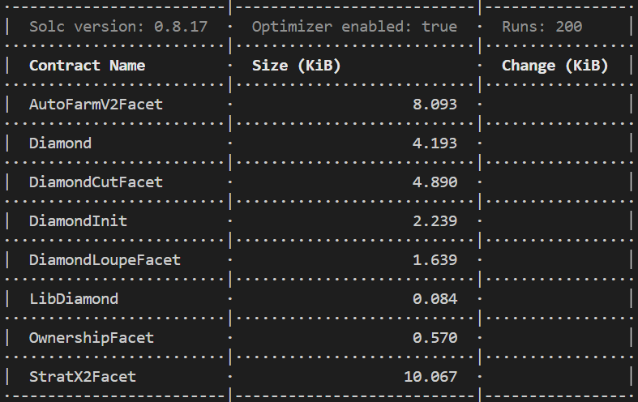

# AutofarmV2 with Diamond-3-Hardhat Implementation

- In this project i have implemented AutofarmV2 contracts in Diamond-3-Hardhat standard

- This is an implementation for [EIP-2535 Diamond Standard](https://github.com/ethereum/EIPs/issues/2535). To learn about other implementations go here: https://github.com/mudgen/diamond

- The standard loupe functions have been gas-optimized in this implementation and can be called in on-chain transactions. However keep in mind that a diamond can have any number of functions and facets so it is still possible to get out-of-gas errors when calling loupe functions. Except for the `facetAddress` loupe function which has a fixed gas cost.

**Note:** The loupe functions in DiamondLoupeFacet.sol MUST be added to a diamond and are required by the EIP-2535 Diamonds standard.

## Technologies Used

- solidity compiler version : 0.8.17

- [Hardhat](https://hardhat.org/) smart contracts architecture

- [OpenZeppelin](https://www.openzeppelin.com/) contracts

- [chai](https://www.chaijs.com/) for testing

- [solidity-coverage](https://github.com/sc-forks/solidity-coverage) for generating code coverage

## A typical top-level directory layout

├── artifacts # deployed addresses and the ABI of the smart contract

├── contracts # smart contracts solidity files

├── scripts # deployment scripts

├── test # test scripts

├── .env # environment variables template

├── .gitignore

├── hardhat-config.js # hardhat configuration

├── package.json # project details and dependencies

├── README.md

## Installation

1. Clone this repo:

```console
git clone git@github.com:ArunLohmod/AutofarmV2-Diamond-3-Hardhat.git
```

2. Install NPM packages:

```console
cd AutofarmV2-Diamond-3-Hardhat
npm install
```

## Deployment

- Create the .env file and fill in `ALCHEMY_API_KEY` and `PRIVATE_KEY`. The values for the `ALCHEMY_API_KEY` can be obtained from the [Alchemy](https://www.alchemy.com/) website. If you don't have an account, you can create one for free.

- ### Compile the smart contracts

  This will compile the smart contract files using the specified soilidity compiler in `hardhat.config.js`.

  ```console
  npx hardhat compile
  ```

- ### Deploy AutoFarmV2

```console
  npx hardhat run .\scripts\deploy-autofarmv2.js --network <NETWORK>
```

- ### Deploy StratX2

```console
  npx hardhat run .\scripts\deploy-stratx2.js --network <NETWORK>
```

- `<NETWORK>` can be `localhost`, `goerli`, `mainnet` or any other network that is supported and defined in the `hardhat.config.js`.

## Run tests:

```console
npx hardhat test
```

## Smart Contracts size

- To generate the sizes of the smart contracts.

```shell
npx hardhat size-contracts
```



## Code Coverage

- To generate the code coverage report for the test cases of the smart contracts.

```shell
npx hardhat coverage
```


## Facet Information

The `contracts/Diamond.sol` file shows an example of implementing a diamond.

The `contracts/facets/DiamondCutFacet.sol` file shows how to implement the `diamondCut` external function.

The `contracts/facets/DiamondLoupeFacet.sol` file shows how to implement the four standard loupe functions.

The `contracts/facets/AutoFarmV2Facet.sol` file shows the implementation of AutoFarmV2 smart contract of AutoFarm, which is a yield farming aggregator.

The `contracts/facets/StratX2Facet.sol` file shows the implementaion of strategy smart contract of AutoFarm.

The `contracts/libraries/LibDiamond.sol` file shows how to implement Diamond Storage and a `diamondCut` internal function.

The `scripts/deploy-autofarmv2.js` file shows how to deploy diamond for AutoFarmV2.

The `scripts/deploy-stratx2.js` file shows how to deploy diamond for StartX2.

The `test/autofarm-diamond-test.js` file gives tests for the AutoFarmV2Facet.

## How to Get Started Making Your Diamond

1. Reading and understand [EIP-2535 Diamonds](https://github.com/ethereum/EIPs/issues/2535). If something is unclear let me know!

2. Use a diamond reference implementation. You are at the right place because this is the README for a diamond reference implementation.

This diamond implementation is boilerplate code that makes a diamond compliant with EIP-2535 Diamonds.

Specifically you can copy and use the [DiamondCutFacet.sol](./contracts/facets/DiamondCutFacet.sol) and [DiamondLoupeFacet.sol](./contracts/facets/DiamondLoupeFacet.sol) contracts. They implement the `diamondCut` function and the loupe functions.

The [Diamond.sol](./contracts/Diamond.sol) contract could be used as is, or it could be used as a starting point and customized. This contract is the diamond. Its deployment creates a diamond. It's address is a stable diamond address that does not change.

The [LibDiamond.sol](./contracts/libraries/LibDiamond.sol) library could be used as is. It shows how to implement Diamond Storage. This contract includes contract ownership which you might want to change if you want to implement DAO-based ownership or other form of contract ownership. Go for it. Diamonds can work with any kind of contract ownership strategy. This library contains an internal function version of `diamondCut` that can be used in the constructor of a diamond or other places.

## Calling Diamond Functions

In order to call a function that exists in a diamond you need to use the ABI information of the facet that has the function.

Here is an example that uses web3.js:

```javascript
let myUsefulFacet = new web3.eth.Contract(MyUsefulFacet.abi, diamondAddress);
```

In the code above we create a contract variable so we can call contract functions with it.

In this example we know we will use a diamond because we pass a diamond's address as the second argument. But we are using an ABI from the MyUsefulFacet facet so we can call functions that are defined in that facet. MyUsefulFacet's functions must have been added to the diamond (using diamondCut) in order for the diamond to use the function information provided by the ABI of course.

Similarly you need to use the ABI of a facet in Solidity code in order to call functions from a diamond. Here's an example of Solidity code that calls a function from a diamond:

```solidity
string result = MyUsefulFacet(address(diamondContract)).getResult()
```

## Get Help and Join the Community

If you need help or would like to discuss diamonds then send me a message [on twitter](https://twitter.com/mudgen), or [email me](mailto:nick@perfectabstractions.com). Or join the [EIP-2535 Diamonds Discord server](https://discord.gg/kQewPw2).

## Useful Links

1. [Introduction to the Diamond Standard, EIP-2535 Diamonds](https://eip2535diamonds.substack.com/p/introduction-to-the-diamond-standard)
1. [EIP-2535 Diamonds](https://github.com/ethereum/EIPs/issues/2535)
1. [Understanding Diamonds on Ethereum](https://dev.to/mudgen/understanding-diamonds-on-ethereum-1fb)
1. [Solidity Storage Layout For Proxy Contracts and Diamonds](https://medium.com/1milliondevs/solidity-storage-layout-for-proxy-contracts-and-diamonds-c4f009b6903)
1. [New Storage Layout For Proxy Contracts and Diamonds](https://medium.com/1milliondevs/new-storage-layout-for-proxy-contracts-and-diamonds-98d01d0eadb)
1. [Upgradeable smart contracts using the Diamond Standard](https://hiddentao.com/archives/2020/05/28/upgradeable-smart-contracts-using-diamond-standard)
1. [buidler-deploy supports diamonds](https://github.com/wighawag/buidler-deploy/)

## Author

This example implementation was written by Nick Mudge.

Contact:

- https://twitter.com/mudgen
- nick@perfectabstractions.com

## License

MIT license. See the license file.
Anyone can use or modify this software for their purposes.
